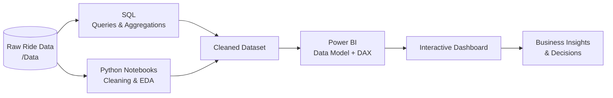

<div align="center">

# 🚖 Ola Ride Analytics
### End-to-End Business Intelligence Project · SQL × Python × Power BI

*Turning raw ride bookings into decisions on revenue, cancellations, customers and demand.*

<br>


<br>

[📊 Live Dashboard](#-live-dashboard) ·
[🎯 Objectives](#-business-objectives) ·
[🧱 Architecture](#-project-architecture) ·
[🔍 Insights](#-key-insights) ·
[📁 Structure](#-repository-structure) ·
[⚙️ Run It](#%EF%B8%8F-how-to-run)

</div>

---

## 📌 Table of Contents

1. [Project Overview](#-project-overview)
2. [Live Dashboard](#-live-dashboard)
3. [Business Objectives](#-business-objectives)
4. [Dataset](#-dataset)
5. [Project Architecture](#-project-architecture)
6. [Dashboard Pages](#-dashboard-pages)
7. [Key Insights](#-key-insights)
8. [DAX Measures](#-dax-measures)
9. [SQL Analysis](#-sql-analysis)
10. [Python Notebooks](#-python-notebooks)
11. [Repository Structure](#-repository-structure)
12. [How to Run](#%EF%B8%8F-how-to-run)
13. [Business Impact](#-business-impact)
14. [Key Learnings](#-key-learnings)
15. [Future Enhancements](#-future-enhancements)
16. [Author](#-author)

---

## 🌟 Project Overview

Ride-hailing platforms like **Ola** handle thousands of bookings every day. Behind every ride sits a question: *Was it completed? Who cancelled, and why? Which vehicle earns the most? When and where does demand spike?*

This project answers those questions with a complete analytics workflow:

| Stage | What happens | Tool |
|:--:|:--|:--:|
| 🗄️ **Extract & Query** | Business questions answered with SQL | `SQL` |
| 🧹 **Clean & Explore** | Data cleaning, EDA, feature engineering | `Python` · `Jupyter` |
| 🧮 **Model & Measure** | Data model, relationships, DAX KPIs | `Power BI` |
| 🎨 **Visualise** | Interactive, multi-page dashboard | `Power BI` |

> 💡 **The goal:** not just charts, but a dashboard a business stakeholder can open and act on.

---

## 🚀 Live Dashboard

<div align="center">

### 👉 [**Click here to open the interactive Power BI report**](YOUR_POWER_BI_PUBLISH_LINK) 👈


*Replace the link above with your Power BI "Publish to web" URL, and `Dashboard/preview.png` with a screenshot of your best page.*

</div>

---

## 🎯 Business Objectives

- 📈 Track overall **bookings, revenue and distance** performance
- ❌ Understand **cancellations**: who cancels (customer vs driver) and why
- 🚗 Compare **vehicle types** by revenue, volume and completion rate
- 👥 Analyse **customer behaviour** and payment preferences
- 📍 Discover **peak hours, days and high-demand locations**
- 💰 Estimate **revenue lost** due to incomplete rides
- 🧭 Enable **data-driven operational and pricing decisions**

---

## 📂 Dataset

| Property | Details |
|:--|:--|
| **Source** | `ADD SOURCE (e.g. Kaggle link)` |
| **Records** | `XX,XXX` ride bookings |
| **Time period** | `MMM YYYY – MMM YYYY` |
| **Granularity** | One row per booking |

**Key fields**

| Category | Columns |
|:--|:--|
| 🆔 Booking | Booking ID, Booking Status, Booking Value |
| 🚗 Vehicle | Vehicle Type (Auto, Bike, Prime Sedan, Prime SUV, Mini, eBike, …) |
| 👤 Customer | Customer ID, Customer Rating, Driver Rating |
| 📍 Trip | Pickup Location, Drop Location, Ride Distance |
| 🕒 Time | Date, Time, Month, Quarter, Time Slot |
| 💳 Payment | Payment Method |
| ❌ Cancellation | Cancelled by Customer / Driver, Cancellation Reason |

> 📝 *Edit this table to match your actual columns.*

---

## 🧱 Project Architecture



---

## 📊 Dashboard Pages

> Add your screenshots to the `Dashboard/` folder and update the image paths below.

### 1️⃣ Overview
**Purpose:** executive snapshot of the entire operation.
- **KPIs:** Total Bookings · Completed Rides · Cancelled Rides · Total Revenue · Total Distance · Avg Booking Value
- **Visuals:** booking trend, status split, revenue by vehicle type, top locations


### 2️⃣ Vehicle Analysis
**Purpose:** find which vehicle types drive revenue and which underperform.
- Bookings and revenue by vehicle type
- Completion vs. cancellation rate per vehicle
- Average distance and booking value per vehicle


### 3️⃣ Revenue Analysis
**Purpose:** understand where money is made and lost.
- Monthly / quarterly revenue trend and MoM growth
- Revenue by payment method
- Revenue per km and average revenue per booking
- Estimated revenue lost to cancellations


### 4️⃣ Cancellation & Customer Analysis
**Purpose:** reduce cancellations and improve customer experience.
- Customer vs. driver cancellation rate
- Top cancellation reasons
- Rating distribution and customer behaviour


### 5️⃣ Location & Time Demand
**Purpose:** optimise driver allocation and surge decisions.
- Top pickup and drop locations
- Peak hours and busiest days (heatmap)
- Distance covered by area


---

## 🔍 Key Insights

> ⚠️ *Replace the placeholders with your real findings. Specific numbers make a README stand out.*

| # | Insight | Impact |
|:-:|:--|:--|
| 1 | **XX%** of all bookings were completed; **XX%** were cancelled | Highlights the size of the cancellation problem |
| 2 | **`Vehicle type`** generates the highest revenue (**₹X.XX L**) | Prioritise supply for this segment |
| 3 | Most common cancellation reason: **`reason`** | Target for process fixes |
| 4 | Peak demand between **`HH:00 – HH:00`** | Plan driver availability and incentives |
| 5 | **`Payment method`** is the most used payment mode | Inform payment partnerships |
| 6 | Estimated **₹X.XX L** revenue lost to cancellations | Quantifies the opportunity |

---

## 🧮 DAX Measures

A few of the measures powering the dashboard (edit to match your model):

```DAX
Total Bookings = COUNTROWS ( 'Rides' )

Completed Rides =
CALCULATE ( [Total Bookings], 'Rides'[Booking Status] = "Completed" )

Cancellation Rate % =
DIVIDE (
    CALCULATE ( [Total Bookings], 'Rides'[Booking Status] <> "Completed" ),
    [Total Bookings]
)

Total Revenue =
CALCULATE ( SUM ( 'Rides'[Booking Value] ), 'Rides'[Booking Status] = "Completed" )

Revenue per KM = DIVIDE ( [Total Revenue], SUM ( 'Rides'[Ride Distance] ) )

MoM Revenue Growth % =
VAR Prev = CALCULATE ( [Total Revenue], DATEADD ( 'Date'[Date], -1, MONTH ) )
RETURN DIVIDE ( [Total Revenue] - Prev, Prev )
```

---

## 🗄️ SQL Analysis

The `SQL/` folder contains queries used to explore the data and validate dashboard numbers, such as:

- ✅ Total bookings by status
- 🚗 Revenue and completion rate by vehicle type
- ❌ Top cancellation reasons (customer vs. driver)
- ⏰ Bookings by hour of day and day of week
- 📍 Top pickup / drop locations
- 💳 Revenue by payment method

```sql
-- Example: completion rate by vehicle type
SELECT
    vehicle_type,
    COUNT(*)                                                   AS total_bookings,
    ROUND(100.0 * SUM(CASE WHEN booking_status = 'Completed' THEN 1 ELSE 0 END)
          / COUNT(*), 2)                                       AS completion_rate_pct
FROM rides
GROUP BY vehicle_type
ORDER BY completion_rate_pct DESC;
```

---

## 🐍 Python Notebooks

The `notebooks/` folder covers:

- 🧹 Data cleaning (missing values, duplicates, data types)
- 🔎 Exploratory Data Analysis with **pandas**, **matplotlib** and **seaborn**
- 🛠️ Feature engineering (hour, weekday, month, time slot)
- 📤 Export of a clean dataset for Power BI

---

## 📁 Repository Structure

```text
Ola-Ride-Analytics-PowerBI/
│
├── 📂 Dashboard/        # Dashboard screenshots & preview images
├── 📂 Data/             # Raw and cleaned datasets
├── 📂 notebooks/        # Jupyter notebooks (cleaning, EDA)
├── 📂 Power BI/         # .pbix report file
├── 📂 SQL/              # SQL queries for analysis
├── 📄 .gitattributes
└── 📄 README.md
```

---

## ⚙️ How to Run

1. **Clone the repository**
   ```bash
   git clone https://github.com/YOUR_USERNAME/Ola-Ride-Analytics-PowerBI.git
   cd Ola-Ride-Analytics-PowerBI
   ```
2. **Open the dashboard**
   - Install [Power BI Desktop](https://powerbi.microsoft.com/desktop/) (free, Windows)
   - Open the `.pbix` file inside the `Power BI/` folder
   - If prompted, point the data source to the `Data/` folder → **Refresh**
3. **Run the notebooks** *(optional)*
   ```bash
   pip install pandas numpy matplotlib seaborn jupyter
   jupyter notebook notebooks/
   ```
4. **Run the SQL queries** *(optional)*
   - Load the dataset from `Data/` into your database (MySQL / PostgreSQL / SQL Server)
   - Run the scripts in `SQL/`

---

## 📈 Business Impact

This analysis helps an operator like Ola to:

- ✅ **Reduce cancellations** by targeting the top reasons
- ✅ **Increase revenue** by focusing on high-performing vehicle types and peak slots
- ✅ **Improve driver allocation** using time and location demand patterns
- ✅ **Enhance customer experience** through rating and behaviour analysis
- ✅ **Support pricing decisions** with revenue-per-km and demand insights

---

## 📚 Key Learnings

- Building an **end-to-end analytics pipeline** (SQL → Python → Power BI)
- Designing a clean **data model** with a proper date table
- Writing **DAX** for real business KPIs and time intelligence
- **Storytelling with data**, which means turning numbers into decisions
- Dashboard **UX**: navigation, layout and colour consistency

---

## 🔮 Future Enhancements

- [ ] Demand forecasting with machine learning
- [ ] Cancellation prediction model
- [ ] Driver performance analytics
- [ ] Automated refresh from a live database
- [ ] Row-level security and mobile layout

---

## 👤 Author

<div align="center">

**Vishal Dokhe**
*Aspiring Data Analyst · SQL · Python · Power BI*

[](https://linkedin.com/in/YOUR_PROFILE)
[](https://github.com/YOUR_USERNAME)
[](mailto:YOUR_EMAIL)

</div>

---

## 📎 Note

This project was built for **learning, portfolio and demonstration purposes** using a sample dataset. It is not affiliated with Ola.

<div align="center">

⭐ **If you found this project useful, please give it a star!** ⭐

</div>
