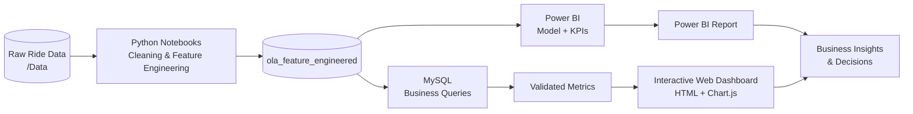

<div align="center">

# 🚖 Ola Ride Analytics
### Fleet Intelligence Dashboard · MySQL × Python × Power BI × Interactive Web Dashboard

*49,999 ride bookings · 50 service areas · 7 vehicle types · January 2024, turned into decisions on revenue, cancellations, riders and demand.*

<br>


<br>

### 👉 [**Open the Live Dashboard**](https://ola-ride-analytics-power-bi.vercel.app) 👈

<br>

[🎯 Objectives](#-business-objectives) ·
[📂 Dataset](#-dataset) ·
[🧱 Architecture](#-project-architecture) ·
[📊 Dashboard](#-dashboard-pages) ·
[🔍 Insights](#-key-insights) ·
[🗄️ SQL](#%EF%B8%8F-sql-analysis) ·
[📁 Structure](#-repository-structure) ·
[⚙️ Run It](#%EF%B8%8F-how-to-run)

</div>

---

## 📌 Table of Contents

1. [Project Overview](#-project-overview)
2. [Business Objectives](#-business-objectives)
3. [Dataset](#-dataset)
4. [Project Architecture](#-project-architecture)
5. [Dashboard Pages](#-dashboard-pages)
6. [Key Insights](#-key-insights)
7. [SQL Analysis](#%EF%B8%8F-sql-analysis)
8. [Repository Structure](#-repository-structure)
9. [How to Run](#%EF%B8%8F-how-to-run)
10. [Business Impact](#-business-impact)
11. [Key Learnings](#-key-learnings)
12. [Future Enhancements](#-future-enhancements)
13. [Author](#-author)

---

## 🌟 Project Overview

A ride-hailing platform like **Ola** handles tens of thousands of bookings a month. Behind every booking sit the questions that decide profitability: *Was the ride completed? Who cancelled, and why? Which vehicle earns the most? When and where does demand peak?*

This project answers them with a complete analytics workflow:

| Stage | What happens | Tool |
|:--:|:--|:--:|
| 🧹 **Prepare** | Cleaning and feature engineering (Month, Day Name, Hour, Time Slot) | `Python` · `Jupyter` |
| 🗄️ **Query** | 30+ business queries on the `ola_feature_engineered` table | `MySQL` |
| 🧮 **Model & Visualise** | Data model, KPIs and a multi-page report | `Power BI` |
| 🌐 **Publish** | 5-page interactive dashboard (dark theme, animated KPIs) | `HTML` · `CSS` · `JavaScript` · `Chart.js` |

> 💡 **Goal:** not just charts, but a dashboard a business stakeholder can open and act on.

---

## 🎯 Business Objectives

- 📈 Track overall **bookings, revenue, fares and distance**
- ❌ Understand **cancellations**: who cancels (rider vs. driver) and why
- 🚗 Compare **7 vehicle types** on volume, revenue, fare, distance and ratings
- 💳 See how revenue splits across **payment methods**
- 📍 Find the busiest **pickup and drop areas** among 50 service areas
- ⏰ Discover **peak hours, time slots and weekdays**
- ⭐ Monitor **driver and customer ratings**

---

## 📂 Dataset

| Property | Details |
|:--|:--|
| **Table** | `ola_feature_engineered` (database: `ola_analytics`) |
| **Records** | **49,999** ride bookings |
| **Period** | **1 Jan 2024 – 31 Jan 2024** |
| **Unique riders** | 48,669 |
| **Service areas** | 50 (`Area-1` … `Area-50`) |
| **Vehicle types** | Auto · Bike · eBike · Mini · Prime Plus · Prime Sedan · Prime SUV |
| **Booking statuses** | Success · Cancelled by Driver · Cancelled by Customer · Incomplete |
| **Payment methods** | Cash · UPI · Card · Wallet |

**Key columns**

| Category | Columns |
|:--|:--|
| 🆔 Booking | `Booking Status`, `Booking Value`, `Date`, `Customer ID` |
| 🚗 Vehicle & Trip | `Vehicle Type`, `Pickup Location`, `Drop Location`, `Ride Distance` |
| ⭐ Ratings | `Driver Ratings`, `Customer Rating` |
| 💳 Payment | `Payment Method` |
| ❌ Cancellations | `Reason for Cancelling by Customer`, `Reason for Cancelling by Driver`, `Cancelled Rides by Driver`, `Incomplete Rides Reason` |
| 🛠️ Engineered | `Month`, `Month Name`, `Day Name`, `Hour`, `Time Slot` |

---

## 🧱 Project Architecture



---

## 📊 Dashboard Pages

The interactive dashboard has **5 pages** with sidebar navigation and animated KPI cards.

### 1️⃣ Overview: *Fleet Summary*
**KPIs:** Total Rides **49,999** · Success Rate **66.97%** · Total Revenue **₹3.43 Cr** · Average Fare **₹1,023** · Cancellation Rate **26.82%** · Unique Riders **48,669**
**Visuals:** daily revenue trend, booking outcome donut, rides by time slot, bookings by vehicle type, rides by day of week.


---

### 2️⃣ Revenue & Fares: *Money in Motion*
**KPIs:** Total Revenue · Average Fare · Top Vehicle by Revenue (**Bike**, ₹49.58 L) · Top Payment Method (**Cash**, 8,552 bookings)
**Visuals:** revenue by vehicle type, revenue by payment method, average fare by vehicle, average distance by vehicle.


---

### 3️⃣ Operations & Cancellations: *Service Reliability*
**KPIs:** Cancelled by Driver **9,610** (19.22%) · Cancelled by Rider **3,799** (7.60%) · Avg. Time to Pickup **10.48 min** · Avg. Trip Turnaround **15.56 min**
**Visuals:** booking status breakdown, top rider cancellation reasons, top driver cancellation reasons, incomplete ride reasons.


---

### 4️⃣ Locations & Riders: *Where Demand Lives*
**KPIs:** 50 service areas · Busiest pickup **Area-39** (1,100) · Busiest drop-off **Area-39** (1,058) · 48,669 unique riders
**Visuals:** top 10 pickup areas, top 10 drop areas, most frequent riders.


---

### 5️⃣ Ratings & Timing: *Quality & Rhythm*
**KPIs:** Avg. Driver Rating **4.00** · Avg. Customer Rating **4.00** · Avg. Ride Distance **25.45 km** · Total Distance **852,072 km**
**Visuals:** driver and customer rating by vehicle, rides by hour of day, rides by day of week.


---

## 🔍 Key Insights

| # | Insight | Numbers |
|:-:|:--|:--|
| 1 | **Only two in three rides succeed.** | 33,484 of 49,999 bookings completed (**66.97%**) |
| 2 | **Drivers cancel about 2.5× more than riders.** | 9,610 driver cancellations vs. 3,799 rider cancellations |
| 3 | **Top driver cancellation reason is overcrowding.** | "More than permitted people" · 2,512 cases, ahead of personal/car issues (2,413) |
| 4 | **Rider cancellations are spread across five reasons.** | "Driver is not moving towards pickup" leads with 793; AC not working (792) and change of plans (756) follow closely |
| 5 | **Revenue is evenly spread across vehicle types.** | Every class earns ₹48.4 L – ₹49.6 L; **Bike** leads at ₹49.58 L |
| 6 | **Prime Plus has the most bookings.** | 7,252 bookings; all 7 classes sit between 7,010 and 7,252 |
| 7 | **Average fare is steady at about ₹1,023.** | eBike highest (₹1,027), Auto lowest (₹1,017) |
| 8 | **Cash is the top payment method, but the split is nearly even.** | Cash ₹87.7 L · UPI ₹86.1 L · Wallet ₹85.1 L · Card ₹83.8 L |
| 9 | **Night is the busiest time slot.** | Night 16,698 · Morning 14,388 · Afternoon 10,527 · Evening 8,386 |
| 10 | **Monday and Tuesday are the busiest days.** | 8,324 and 8,283 rides, roughly 25% above the other weekdays (about 6,600 – 6,800) |
| 11 | **Demand is flat across the 24 hours.** | Hourly rides range from 1,995 to 2,171 |
| 12 | **Repeat riding is rare.** | 48,669 unique riders for 49,999 bookings; the most frequent riders took only 3 rides |
| 13 | **Ratings are uniform.** | Driver and customer averages are both **4.00 / 5** across all vehicles |
| 14 | **Pickup is about 10.5 min away.** | Avg. vehicle arrival time 10.48 min; avg. trip turnaround 15.56 min |

> 📝 **Data note:** 31 Jan 2024 holds only a partial day of bookings (₹0.45 L), which is why the daily revenue line drops at the end of the month. Revenue and average fare are calculated across all bookings in the table.

---

## 🗄️ SQL Analysis

**`Ola_SQL_Business_Analysis.sql`** contains 30+ MySQL queries grouped by theme:

| Theme | What it answers |
|:--|:--|
| 📦 **Volume** | Total, successful, cancelled and incomplete rides; booking status split |
| 🚗 **Vehicle** | Bookings, revenue, average fare, distance and ratings per vehicle type |
| 💰 **Revenue** | Total revenue, average fare, monthly revenue, daily revenue, revenue by payment method |
| ❌ **Cancellations** | Rider reasons, driver reasons, cancelled-by-driver and incomplete-ride reasons |
| 📍 **Locations & Riders** | Top 10 pickup areas, top 10 drop areas, top 10 most frequent customers |
| ⏰ **Time** | Rides by time slot, hour, month and day of week |
| ⭐ **Ratings** | Average driver and customer ratings, overall and by vehicle |

```sql
-- Revenue by vehicle type
SELECT
    `Vehicle Type`,
    ROUND(SUM(`Booking Value`), 2) AS Revenue
FROM ola_feature_engineered
GROUP BY `Vehicle Type`
ORDER BY Revenue DESC;

-- Top 10 pickup locations
SELECT
    `Pickup Location`,
    COUNT(*) AS Total_Bookings
FROM ola_feature_engineered
GROUP BY `Pickup Location`
ORDER BY Total_Bookings DESC
LIMIT 10;
```

---

## 📁 Repository Structure

```text
Ola-Ride-Analytics-PowerBI/
│
├── 📂 Dashboard/
│   ├── OLA_Ride_Analytics_Dashboard_1.html   # Interactive 5-page web dashboard
│   └── screenshots/                           # overview, revenue, operations, locations, ratings (.png)
├── 📂 Data/                                   # Raw and feature-engineered datasets
├── 📂 notebooks/                              # Jupyter notebooks (cleaning, feature engineering, EDA)
├── 📂 Power BI/                               # Power BI report (.pbix)
├── 📂 SQL/
│   └── Ola_SQL_Business_Analysis.sql          # MySQL business analysis queries
├── 📄 .gitattributes
└── 📄 README.md
```

---

## ⚙️ How to Run

1. **Clone the repository**
   ```bash
   git clone https://github.com/Vishal-Dokhe/Ola-Ride-Analytics-PowerBI.git
   cd Ola-Ride-Analytics-PowerBI
   ```
2. **View the web dashboard**
   - Open `Dashboard/OLA_Ride_Analytics_Dashboard_1.html` in any modern browser
   - An internet connection is needed to load Chart.js and the fonts from a CDN
3. **Open the Power BI report**
   - Install [Power BI Desktop](https://powerbi.microsoft.com/desktop/) (free, Windows)
   - Open the `.pbix` file inside `Power BI/` and **Refresh** if prompted
4. **Run the SQL analysis**
   - Load the dataset from `Data/` into MySQL as `ola_feature_engineered`
   - Run `SQL/Ola_SQL_Business_Analysis.sql`
5. **Run the notebooks** *(optional)*
   ```bash
   pip install pandas numpy matplotlib seaborn jupyter
   jupyter notebook notebooks/
   ```

---

## 📈 Business Impact

This analysis helps an operator like Ola to:

- ✅ **Cut driver cancellations** (19% of all bookings) by targeting overcrowding and car-related causes
- ✅ **Lift the success rate** from 67% by tackling pickup delays and rider-side cancellations
- ✅ **Plan supply** around Night and Morning slots and the busy Monday–Tuesday window
- ✅ **Focus on hot zones** such as Area-39, the top pickup and drop area
- ✅ **Convert one-time riders** into repeat customers with retention offers
- ✅ **Track quality** with ratings and pickup-time metrics

---

## 📚 Key Learnings

- Building an **end-to-end pipeline**: Python → MySQL → Power BI → web dashboard
- Writing **30+ analytical SQL queries** with aggregation, filtering and ranking
- Designing **KPI-led dashboards** with clear navigation and a consistent theme
- Turning raw numbers into **business recommendations**
- Spotting **data quirks**, such as a partial last day and near-uniform distributions

---

## 🔮 Future Enhancements

- [ ] Cancellation prediction model
- [ ] Demand forecasting by area and hour
- [ ] Driver-level performance analytics
- [ ] Live database connection with scheduled refresh
- [ ] Filters and slicers (date, vehicle, area) in the web dashboard

---

## 👤 Author

<div align="center">

**Vishal Dokhe**
*Aspiring Data Analyst · SQL · Python · Power BI*

[](https://github.com/Vishal-Dokhe)
[](https://www.linkedin.com/in/vishalbdokhe9511)
[](mailto:vishaldokhe9511@gmail.com)

📧 [vishaldokhe9511@gmail.com](mailto:vishaldokhe9511@gmail.com) · 💼 [linkedin.com/in/vishalbdokhe9511](https://www.linkedin.com/in/vishalbdokhe9511) · 🐙 [github.com/Vishal-Dokhe](https://github.com/Vishal-Dokhe)

</div>

---

## 📎 Note

This project was built for **learning, portfolio and demonstration purposes** using a sample dataset (49,999 bookings, January 2024). It is not affiliated with Ola.

<div align="center">

⭐ **If you found this project useful, please give it a star!** ⭐

</div>
